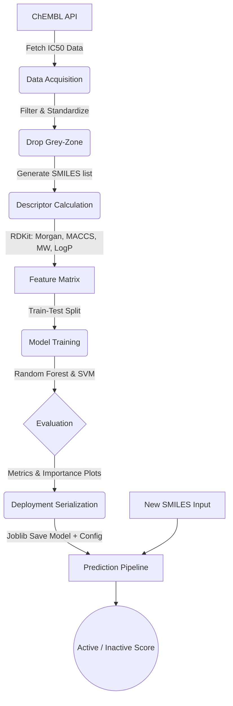

# QSAR Model: Predicting Molecular Activity

## Project Overview
This project builds a Quantitative Structure-Activity Relationship (QSAR) model to predict whether a given molecule will be active or inactive against a specific target protein, without the need for computational docking. By combining ligand-based drug design (LBDD), cheminformatics, and machine learning, this pipeline:
1. Fetches bioactivity data (IC50) from the ChEMBL database.
2. Calculates molecular descriptors (Morgan fingerprints, physicochemical properties) from SMILES strings using RDKit.
3. Trains and optimizes a Random Forest and Support Vector Machine (SVM) model.
4. Serializes the model and its explicit configuration for reproducible inference on new molecules.

**Default Target:** Epidermal Growth Factor Receptor (EGFR) - `CHEMBL203`

---

## Architecture Diagram


---

## Installation Instructions

1. **Clone the repository** (if applicable) and navigate to the project root:
   ```bash
   cd QSAR
   ```

2. **Create a virtual environment (Recommended)**:
   Using `conda`:
   ```bash
   conda create -n qsar_env python=3.12 -y
   conda activate qsar_env
   ```

3. **Install dependencies**:
   ```bash
   pip install -r requirements.txt
   ```

---

## Usage Guide

### 1. Running the Pipeline End-to-End
Execute the main script to run the entire pipeline (Fetch -> Calculate -> Train -> Document):
```bash
python main.py
```
**Expected Output**:
- Console logs tracking the download (from ChEMBL) and feature calculation progress.
- Clean feature CSV saved in the `data/` directory.
- Model artifacts (`qsar_model.pkl`, `qsar_config.pkl`) stored in the `data/` directory.
- PNG plots (Confusion Matrix, Feature Importance) and `summary_report.json` saved in the `outputs/` directory.

### 2. Running Unit Tests
Validate the modular setup with `pytest`:
```bash
pytest tests/
```

### 3. Predicting New Molecules
You can utilize the `QSARPredictor` imported from `src.model_deployer`:
```python
from src.config import QSARConfig
from src.model_deployer import QSARPredictor

config = QSARConfig()
# Requires a pre-trained model mapping to data/qsar_model.pkl and data/qsar_config.pkl
predictor = QSARPredictor(config.model_path, config.config_path)

test_smiles = "COc1cc2ncnc(Nc3ccc(F)c(Cl)c3)c2cc1OCCCN4CCOCC4" # Gefitinib
result = predictor.predict(test_smiles)
print(result)
```

---

## Results Section
*Note: Results populate after your first successful execution of `main.py`.*
- **Classification Accuracy**: See `outputs/summary_report.json`
- **ROC-AUC**: Documented in `outputs/summary_report.json`
- **Feature Importance**: See `outputs/rf_feature_importance.png`

---

## Dependencies
This project requires Python 3.12 and the following core libraries:
- `chembl_webresource_client==0.9.34`
- `rdkit==2023.9.5`
- `pandas==2.2.1`
- `scikit-learn==1.4.1.post1`
- *For a full strict version list, see `requirements.txt`*

---

## Troubleshooting

- **SMILES Parsing Failures:** Some compounds from ChEMBL possess corrupted SMILES representations. The `_validate_and_parse` function logs and filters these structural failures out. They will shrink your overall dataset slightly. 
- **API Limits:** The `chembl_webresource_client` can occasionally hit rate-limits or timeout. Re-running the pipeline or caching results locally can mitigate connection gaps.
- **Model Loading Errors:** Ensure `QSARPredictor` always loads `qsar_config.pkl` to fetch identical bit lengths (`morgan_nbits`) that were present during original model training, avoiding invisible dependency breaks.

---

## Future Enhancements
- Automate a GridSearch optimization specifically tailored to the SVM kernels over a wider chemical applicability domain.
- Incorporate Deep Learning variants (e.g., Graph Neural Networks on SMILES).
- Multi-target QSAR tracking via extended Config profiles instead of single ChEMBL ID queries.

## References
1. [ChEMBL Database](https://www.ebi.ac.uk/chembl/)
2. [RDKit: Open-Source Cheminformatics](http://www.rdkit.org/)
3. Bento, A. P., et al. (2014). "The ChEMBL bioactivity database..." *Nucleic Acids Research*, 42(D1), D1083-D1090.
